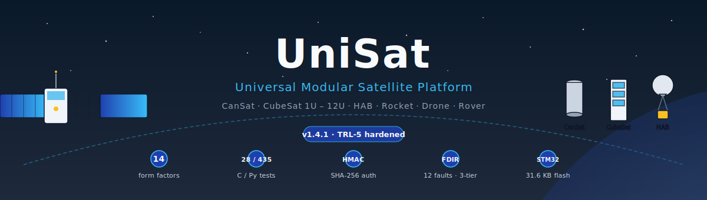
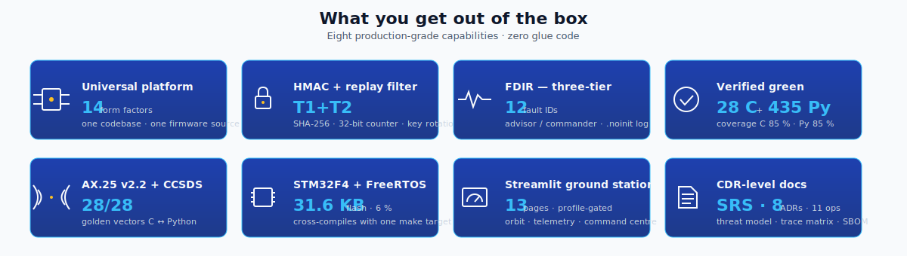
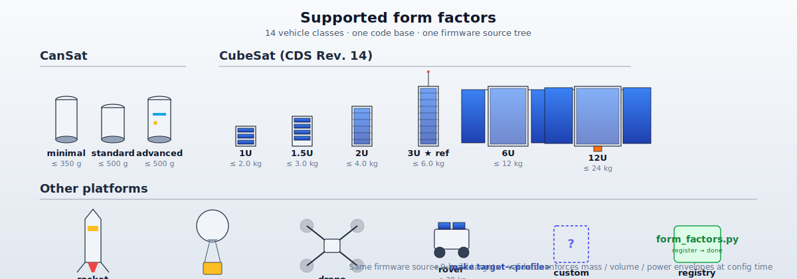

<p align="center">
  
</p>

<p align="center">
  <a href="scripts/verify.sh"></a>
  <a href="docs/security/ax25_threat_model.md"></a>
  <a href="docs/verification/ax25_trace_matrix.md"></a>
  <a href="flight-software/tests"></a>
  <a href="docs/quality/static_analysis.md"></a>
  <a href="firmware/build-arm"></a>
  <a href="LICENSE"></a>
  <a href="https://www.python.org/"></a>
  <a href="#"></a>
  <a href="#"></a>
</p>

<p align="center">
  <b>Version 1.4.1 — Universal Platform (CanSat + CubeSat 1U–12U + HAB + Rocket + Drone + Rover)</b><br>
  <i>Professional open-source flight software for any small-satellite class</i>
</p>

<p align="center">
  
</p>

---

## 60-second tour

```bash
git clone https://github.com/root3315/unisat.git && cd unisat
./scripts/verify.sh                                # full green pipeline (Docker)
cp mission_templates/cubesat_3u.json mission_config.json
make target-cubesat_3u                             # → firmware/build-arm-cubesat_3u/
cd ground-station && streamlit run app.py          # → http://localhost:8501
```

Prefer CanSat? Replace `cubesat_3u` with `cansat_standard`. Going to a specific competition? Pick the preset that matches its rulebook — e.g. `cansat_uzcansat.json` for [🇺🇿 UzCanSat 2026](https://training.cmspace.uz/youth-projects/16). The firmware, flight-software, and ground-station all reconfigure themselves from `mission_config.json`.

Full step-by-step: [`docs/guides/USAGE_GUIDE.md`](docs/guides/USAGE_GUIDE.md) · per-profile playbooks: [`docs/ops/`](docs/ops/README.md) · full docs index: [`docs/README.md`](docs/README.md) · mission templates: [`mission_templates/`](mission_templates/).

---

## Overview

**UniSat** is a complete, modular flight-software platform that targets the full spectrum of student and research vehicles in a single codebase:

- CanSat — minimal / standard / advanced (≤350 g, ≤500 g)
- CubeSat — 1U, 1.5U, 2U, 3U, 6U, 12U
- Suborbital rockets, high-altitude balloons, drones and rovers

The same STM32 firmware, the same Python flight controller, and the same Streamlit ground station reconfigure themselves automatically from `mission_config.json`. A form-factor registry enforces mass/volume/power envelopes (CDS Rev. 14 for CubeSats, ESA CanSat regulations for CanSats), and a deterministic feature-flag resolver gates every optional subsystem so the build contains only what the mission actually needs.

---

## Обзор (Русский)

**UniSat** — универсальная программная платформа, которая из одного репозитория запускает:

- **CanSat** — minimal / standard / advanced (≤350 г и ≤500 г);
- **CubeSat** — 1U, 1.5U, 2U, 3U, 6U, 12U;
- суборбитальные ракеты, стратосферные зонды, БПЛА и роверы.

Одна и та же прошивка STM32, один и тот же полётный контроллер на Python и одна и та же наземная станция на Streamlit сами подстраиваются под активную миссию через `mission_config.json`. Реестр форм-факторов проверяет массу/объём/энергетику (CDS Rev. 14 для CubeSat, правила ESA для CanSat), а детерминированный резолвер фич-флагов включает только те подсистемы, которые нужны конкретному аппарату.

---

## 🔒 What's new in v1.2.0 — TRL-5 hardening

Version 1.2.0 landed an eight-phase hardening sweep (75 commits
on `feat/trl5-hardening`) that promotes UniSat from "competition-
ready template" to **TRL-5-capable software platform**. Full
details in [CHANGELOG.md](CHANGELOG.md) — summary:

### Phase 1 — Real ARM target build
- STM32F446RE LD script, startup.s, SystemInit/clock at 168 MHz
- FreeRTOS kernel + CMSIS-RTOSv2 + HAL autodetect in CMake
- `make setup-all && make target` produces a real `.elf`
- **Verified footprint:** 31.6 KB flash (6 %) / 36.3 KB RAM (28 %)

### Phase 2 — Security (T1 + T2 both closed)
- **T1 (injection):** HMAC-SHA256 + constant-time verify
- **T2 (replay):** 32-bit counter + 64-bit sliding-window bitmap
- Persistent key store (A/B flash slots + CRC + monotonic gen)
- Python `CounterSender` — thread-safe ground-side pair

### Phase 3 — FDIR (NASA-style three-tier)
- 12 fault IDs + 60s escalation window + 6-level severity ladder
- Advisor (`fdir.c`) / commander (`mode_manager.c`) split (ADR-005)
- Persistent fault log in `.noinit` SRAM — survives warm reboot

### Phase 4 — Tboard + mission scenario
- Live TMP117 reading in beacon bytes 14-15 (was zero-padded)
- End-to-end mission lifecycle test (startup → nominal → safe →
  recovery) + 48-hour soak harness

### Phase 5 — Quality gates
- `make cppcheck` (CI-blocking) + MISRA advisory
- `make coverage` — **85.3 %** C lines
- `make sanitizers` — ASAN + UBSAN clean
- `cmake -DSTRICT=ON` — `-Werror -Wshadow -Wconversion` clean

### Phase 6 — Documentation (CDR-level)
- **SRS** with 44 REQ + traceability CSV
- **8 ADRs** for architectural decisions
- HIL test plan + characterization templates
- Threat model v2 with T1+T2 closed

### Phase 7 — Python + release plumbing
- `make coverage-py` — **85.15 %** Python lines (gate ≥ 80 % MUST)
- `make lint-py` — mypy strict clean across 21 files
- `make sbom` — auto-generated SPDX bill of materials
- `make pin-docker` — release-engineering digest pin

### Phase 8 — Final polish
- ARM build fully verified end-to-end
- Zero warnings in any build profile
- **Total tests: 27 C + 329 Python = 356 checks**
- **Migrated MIT → Apache 2.0** for patent-grant protection (§3)

### Test + coverage progression

| | Before (v1.1.0) | After (v1.2.0) |
|---|---:|---:|
| C test executables | 16 | **27** |
| Python tests | 34 | **329** |
| C line coverage | not measured | **85.3 %** |
| Python line coverage | not measured | **85.15 %** |
| ARM target `.elf` | not verified | **6 % flash / 28 % RAM** |
| ADRs | 2 | **8** |
| Quality gates | 1 | **9** (all green) |
| License | MIT | **Apache 2.0** |

---

## Architecture

```
┌─────────────────────────────────────────────────────────────┐
│                    GROUND STATION (Python/Streamlit)         │
│  ┌──────────┐ ┌──────────┐ ┌──────────┐ ┌───────────────┐  │
│  │Dashboard │ │Telemetry │ │  Orbit   │ │Command Center │  │
│  │          │ │  Charts  │ │ Tracker  │ │  (HMAC-AUTH)  │  │
│  └──────────┘ └──────────┘ └──────────┘ └───────────────┘  │
└─────────────────────────┬───────────────────────────────────┘
                          │ UHF 437 MHz / S-band 2.4 GHz
                          │ AX.25 / CCSDS Protocol
┌─────────────────────────┴───────────────────────────────────┐
│                      CUBESAT (1U-6U)                         │
│                                                              │
│  ┌──────────────────────────────────────────────────────┐   │
│  │         FLIGHT CONTROLLER (Raspberry Pi Zero 2 W)     │   │
│  │  ┌────────┐ ┌────────┐ ┌────────┐ ┌──────────────┐  │   │
│  │  │Camera  │ │Orbit   │ │Health  │ │  Scheduler   │  │   │
│  │  │Handler │ │Predict │ │Monitor │ │  (asyncio)   │  │   │
│  │  └────────┘ └────────┘ └────────┘ └──────────────┘  │   │
│  └──────────────────────┬───────────────────────────────┘   │
│                         │ UART                               │
│  ┌──────────────────────┴───────────────────────────────┐   │
│  │              OBC FIRMWARE (STM32F4 + FreeRTOS)        │   │
│  │  ┌──────┐ ┌──────┐ ┌──────┐ ┌──────┐ ┌──────────┐  │   │
│  │  │ADCS  │ │EPS   │ │COMM  │ │GNSS  │ │Telemetry │  │   │
│  │  │B-dot │ │MPPT  │ │UHF   │ │u-blox│ │  CCSDS   │  │   │
│  │  │Sun   │ │BatMgr│ │S-band│ │      │ │          │  │   │
│  │  └──────┘ └──────┘ └──────┘ └──────┘ └──────────┘  │   │
│  └──────────────────────────────────────────────────────┘   │
│                                                              │
│  ┌────────────────────┐  ┌───────────────────────────────┐  │
│  │   SOLAR PANELS     │  │      PAYLOAD (swappable)      │  │
│  │   GaAs 29.5% eff.  │  │  Radiation / Camera / IoT /   │  │
│  │   6 panels (3U)    │  │  Magnetometer / Spectrometer   │  │
│  └────────────────────┘  └───────────────────────────────┘  │
└─────────────────────────────────────────────────────────────┘
```

---

## Features

| Subsystem | Description | Technology |
|-----------|-------------|------------|
| **OBC Firmware** | Real-time task management, watchdog, safe mode | STM32F4 + FreeRTOS (C) |
| **ADCS** | B-dot detumbling, sun/nadir/target pointing | Quaternion math, PID control |
| **EPS** | MPPT solar charging, battery management | Perturb & Observe algorithm |
| **Communication** | UHF 9600 bps + S-band 256 kbps | **AX.25 v2.2 full** (streaming decoder, bit-stuffing, CRC-16/X.25, §3.12 addresses) + CCSDS Space Packet + HMAC-SHA256 |
| **Flight Software** | Async mission control, imaging, orbit prediction | Python 3.11+ asyncio |
| **Ground Station** | 10-page dashboard with real-time telemetry | Streamlit + Plotly |
| **Simulation** | Orbit, power, thermal, link budget | Python scientific stack |
| **Configurator** | Web-based mission builder with validation | Streamlit |
| **Payloads** | 5 swappable payload modules | Plugin architecture |

---

## Quick Start

### 1. Clone the repository

```bash
git clone https://github.com/root3315/unisat.git
cd unisat
```

### 2. Install dependencies

```bash
chmod +x scripts/setup.sh
./scripts/setup.sh
```

### 3. Run the ground station

```bash
cd ground-station
pip install -r requirements.txt
streamlit run app.py
```

### 4. Run simulation

```bash
cd simulation
pip install -r requirements.txt
python mission_analyzer.py
```

**Подробное руководство:** [`docs/guides/USAGE_GUIDE.md`](docs/guides/USAGE_GUIDE.md)
— от выбора типа миссии (CanSat / CubeSat / HAB / Rocket / Drone)
до подачи на конкурс.

**Что ещё можно добавить:** [`docs/project/GAPS_AND_ROADMAP.md`](docs/project/GAPS_AND_ROADMAP.md)
— честный статус, приоритизированный список открытых задач.

### 5. End-to-end AX.25 SITL demo (one command)

```bash
# Requires Docker Desktop running. No local gcc/cmake/pytest needed.
./scripts/verify.sh
```

That script builds the `unisat-ci` Docker image once (~30 s), then
runs the full green pipeline inside it: firmware host build →
ctest → pytest → end-to-end SITL beacon demo. Expected final line:
`✓ UniSat green. Ready to submit.`

For more granular control:
- `make all` — build + tests
- `make ci` — same, inside Docker
- `make demo` — just the SITL beacon path
- `make test-c` / `make test-py` — split suites
- `make help` — list all targets

---

## Project Status

**TRL-5 hardening:** all 6 phases on `feat/trl5-hardening` closed.

| Check | Status |
|---|---|
| Firmware host build (all subsystems) | ✅ clean (`unisat_core`) |
| Firmware target build (STM32F446RE .elf/.bin/.hex) | ✅ **verified:** 31.6 KB flash (6%) / 36.3 KB RAM (28%) under 90% budget |
| C unit tests (`ctest`) | ✅ **28 / 28 passing** (100+ sub-tests) |
| Python tests (`pytest`, full suite) | ✅ **420 passing** — 262 flight-software + 82 ground-station + 57 simulation + 19 configurator |
| **Python coverage (MUST gate)** | ✅ **85.15 %** (`make coverage-py`, ≥ 80 % enforced) |
| **Streamlit page import smoke** | ✅ 12/13 passing (1 skipped — streamlit not installed) |
| **Universal platform (v1.3.1)** | ✅ 14 form factors: CanSat min/std/adv + CubeSat 1U/1.5U/2U/3U/6U/12U + rocket/HAB/drone/rover/custom |
| **SBOM (SPDX)** | ✅ `make sbom` generates `docs/sbom/sbom-summary.md` |
| **FreeRTOS autodetect in CMake** | ✅ `make setup-freertos` + `make setup-all` |
| AX.25 golden vectors cross-validation | ✅ 28/28 byte-identical C ↔ Python |
| SHA-256 FIPS 180-4 oracle | ✅ `"abc"` + `""` canonical digests |
| HMAC-SHA256 RFC 4231 vectors | ✅ §4.2 + §4.3 on both C and Python |
| End-to-end SITL demo | ✅ C encoder → TCP → Python decoder |
| E2E mission scenario (startup → nominal → safe) | ✅ flight-software/tests/test_mission_e2e.py |
| Long-soak harness (48 h gated via UNISAT_SOAK_SECONDS) | ✅ test_long_soak.py |
| Driver reality audit | ✅ all 9 drivers verified real (incl. BoardTemp) |
| Threat T1 (command injection) | ✅ HMAC dispatcher |
| Threat T2 (replay) | ✅ 32-bit counter + 64-bit sliding window |
| Persistent key store (A/B + CRC + rotation) | ✅ 10/10 tests |
| **Boot-time key_store → dispatcher wiring in main.c** | ✅ 4/4 integration tests |
| **Python counter-aware HMAC frame builder (CounterSender)** | ✅ 22/22 pytest |
| FDIR fault advisor + watchdog integration | ✅ 9/9 tests, 12 fault IDs |
| **FDIR mode supervisor (SAFE/DEGRADED/REBOOT wiring)** | ✅ 9/9 tests |
| **Persistent fault log (.noinit, survives warm reboot)** | ✅ 6/6 tests |
| Tboard (TMP117) facade in beacon bytes 14–15 | ✅ 6/6 tests |
| cppcheck static-analysis gate | ✅ clean (`make cppcheck`) |
| **Line coverage (C)** | ✅ **85.3 %** / functions 84.0 % (`make coverage`) |
| ASAN + UBSAN under ctest | ✅ 28/28 clean (`make sanitizers`) |
| STRICT mode (-Werror -Wshadow -Wconversion) | ✅ 28/28 clean (`cmake -DSTRICT=ON`) |
| ADRs for architectural decisions | ✅ **8 ADRs** under `docs/adr/` |
| Full SRS + traceability CSV | ✅ docs/requirements/SRS.md |
| HIL test plan + characterization templates | ✅ docs/testing + docs/characterization |
| Requirement traceability (AX.25 subset) | ✅ auto-generated (docs/verification/ax25_trace_matrix.md) |

Deferred (not TRL-5 blockers) — see [`docs/project/GAPS_AND_ROADMAP.md`](docs/project/GAPS_AND_ROADMAP.md):
Streamlit↔AX.25 live bridge, CC1125 radio config doc, MISRA backlog cleanup (~1000 Rule 8.7/10.x style deviations).

### 6. Build firmware manually (optional)

If you don't want to use Docker:

```bash
cd firmware
cmake -B build -S .
cmake --build build
ctest --test-dir build --output-on-failure
```

Cross-compile for STM32F446 (requires `arm-none-eabi-gcc`):

```bash
cd firmware
cmake -B build-arm -S . -DCMAKE_TOOLCHAIN_FILE=arm.cmake
cmake --build build-arm
# Output: build-arm/unisat_firmware.{elf,bin,hex}
```

---

## Supported Form Factors

<p align="center">
  
</p>

UniSat's [form-factor registry](flight-software/core/form_factors.py) is the single source of truth for every supported class. Every envelope in the tables below is enforced at runtime; each row also ships a mission template, a hardware BOM, a compile-time firmware profile, and a dedicated [ops guide](docs/ops/).

| Form factor | Max mass | Dimensions (mm) | ADCS tiers | Typical radios | BOM | Ops guide |
|---|---:|---|---|---|---|---|
| **CanSat minimal** | 350 g | Ø66 × 115 cyl. | none | ISM 433/868/915, LoRa | [`cansat_minimal.csv`](hardware/bom/by_form_factor/cansat_minimal.csv) | [cansat_minimal.md](docs/ops/cansat_minimal.md) |
| **CanSat standard** | 500 g | Ø68 × 80 cyl. | none | ISM, LoRa | [`cansat_standard.csv`](hardware/bom/by_form_factor/cansat_standard.csv) | [cansat_standard.md](docs/ops/cansat_standard.md) |
| **CanSat advanced** | 500 g | Ø68 × 115 cyl. | passive-spin | ISM, UHF amateur | [`cansat_advanced.csv`](hardware/bom/by_form_factor/cansat_advanced.csv) | [cansat_advanced.md](docs/ops/cansat_advanced.md) |
| **CubeSat 1U** | 2.0 kg | 100 × 100 × 113.5 | passive-magnetic | VHF/UHF amateur | [`cubesat_1u.csv`](hardware/bom/by_form_factor/cubesat_1u.csv) | [cubesat_1u.md](docs/ops/cubesat_1u.md) |
| **CubeSat 1.5U** | 3.0 kg | 100 × 100 × 170.25 | magnetorquer | UHF amateur | [`cubesat_1_5u.csv`](hardware/bom/by_form_factor/cubesat_1_5u.csv) | [cubesat_1_5u.md](docs/ops/cubesat_1_5u.md) |
| **CubeSat 2U** | 4.0 kg | 100 × 100 × 227.0 | magnetorquer + sensors | UHF + optional S-band | [`cubesat_2u.csv`](hardware/bom/by_form_factor/cubesat_2u.csv) | [cubesat_2u.md](docs/ops/cubesat_2u.md) |
| **CubeSat 3U** ← TRL-5 ref | 6.0 kg | 100 × 100 × 340.5 | reaction wheels 3-axis | UHF + S-band + X-band | [`cubesat_3u.csv`](hardware/bom/by_form_factor/cubesat_3u.csv) | [cubesat_3u.md](docs/ops/cubesat_3u.md) |
| **CubeSat 6U** | 12.0 kg | 226.3 × 100 × 366 | star tracker fine-pointing | UHF + S + X + Ka | [`cubesat_6u.csv`](hardware/bom/by_form_factor/cubesat_6u.csv) | [cubesat_6u.md](docs/ops/cubesat_6u.md) |
| **CubeSat 12U** | 24.0 kg | 226.3 × 226.3 × 366 | star tracker + propulsion | UHF + S + X + Ka + optical | [`cubesat_12u.csv`](hardware/bom/by_form_factor/cubesat_12u.csv) | [cubesat_12u.md](docs/ops/cubesat_12u.md) |
| **Rocket payload** | 10 kg | Ø100 × 300 cyl. | none / passive-spin | ISM, UHF, S-band | — | [rocket_avionics.md](docs/ops/rocket_avionics.md) |
| **HAB payload** | 4 kg | 150 × 150 × 150 | none | ISM, APRS, UHF amateur | — | [hab_payload.md](docs/ops/hab_payload.md) |
| **Small drone (UAS)** | 5 kg | 500 × 500 × 200 | IMU attitude control | ISM 2.4 GHz | — | [drone.md](docs/ops/drone.md) |

Mission templates live in [`mission_templates/`](mission_templates/) — copy the one you want into `mission_config.json` and the flight controller, firmware, and ground station all follow along. Profile-selection flowchart + trade-offs in [docs/ops/README.md](docs/ops/README.md).

### Picking a profile

```bash
# 1. Choose a template (CanSat, CubeSat 1U … 12U, rocket, HAB, drone).
cp mission_templates/cubesat_3u.json mission_config.json

# 2. Build the matching firmware image.
make target-cubesat-3u       # → firmware/build-arm-cubesat-3u/

# 3. Launch the flight controller and ground station — they read
#    mission_config.json and configure themselves automatically.
cd flight-software && python3 flight_controller.py
cd ground-station && streamlit run app.py
```

Build every profile at once with `make target-all-profiles` (produces
nine separate `build-arm-<profile>/` trees).

### Feature flags

`mission_config.json` accepts a top-level `features` block whose keys
are defined in `flight-software/core/feature_flags.py`. The resolver
combines explicit overrides with platform / form-factor / ADCS-tier /
radio-band gates so the final enabled set is deterministic and logged.
Examples:

```json
"features": {
    "orbit_predictor": true,         // CubeSat-only → disabled for CanSat
    "reaction_wheels": true,         // requires 2U+ and an RW tier
    "star_tracker":   false,         // explicit disable always wins
    "descent_controller": true,      // CanSat / rocket / HAB only
    "parachute_pyro": true,
    "s_band_radio":   true           // requires s_band radio configured
}
```

---

## Competition Adaptation

Ready-to-submit adaptations for aerospace competitions. Detailed per-profile guides live in [`docs/ops/`](docs/ops/) (one file per form factor) + short form in [USAGE_GUIDE.md](docs/guides/USAGE_GUIDE.md) §7.

| Competition | Template | Highlights | Ops guide | Prep time |
|---|---|---|---|---|
| **CanSat (beginner)** | `cansat_minimal.json` | RP2040, ISM 433 MHz, ≤350 g | [cansat_minimal.md](docs/ops/cansat_minimal.md) | 1 evening |
| **🇺🇿 UzCanSat 2026** (cmspace.uz) | `cansat_uzcansat.json` | 1 Hz telemetry, buzzer locator, camera 640×480 @ 30 fps — preset full compliant with [cmspace.uz](https://training.cmspace.uz/youth-projects/16) rulebook | [UZCANSAT_COMPLIANCE.md](docs/missions/cansat_radiation/UZCANSAT_COMPLIANCE.md) | 2–3 days |
| **ESERO / national CanSat** | `cansat_standard.json` | Parachute, IMU, Ø68 × 80 mm, ≤500 g | [cansat_standard.md](docs/ops/cansat_standard.md) | 2–3 days |
| **NASA CanSat** | `cansat_advanced.json` | Pyro deploy, camera, guided descent | [cansat_advanced.md](docs/ops/cansat_advanced.md) | 1 week |
| **CubeSat Design** | `cubesat_3u.json` | 3U LEO, CDR docs, HMAC auth | [cubesat_3u.md](docs/ops/cubesat_3u.md) | 1 week |
| **CubeSat 6U/12U research** | `cubesat_6u.json` / `cubesat_12u.json` | X/Ka-band, propulsion slot | [cubesat_6u.md](docs/ops/cubesat_6u.md) | 2–3 weeks |
| **NASA Space Apps** | Any CubeSat + NDVI | Earth observation | [cubesat_6u.md](docs/ops/cubesat_6u.md) | 48 h |
| **IREC / SA Cup rocket** | `rocket_competition.json` | Dual-deploy, HMAC telemetry | [rocket_avionics.md](docs/ops/rocket_avionics.md) | 2–3 days |
| **HAB flight** | `hab_standard.json` | GNSS + camera | [hab_payload.md](docs/ops/hab_payload.md) | 1 day |
| **UAV survey** | `drone_survey.json` | Mission planner | [drone.md](docs/ops/drone.md) | 1–2 days |

Also: [COMPETITION_GUIDE.md](COMPETITION_GUIDE.md) (short form), [docs/ops/README.md](docs/ops/README.md) (profile-selection flowchart).

---

## Project Structure

```
unisat/
├── firmware/             # STM32F446 firmware (C11 + FreeRTOS)
│   ├── stm32/Core/       #   OBC, COMM, GNSS, CCSDS, telemetry,
│   │                     #   command_dispatcher (HMAC-auth)
│   ├── stm32/Drivers/    #   9 sensor drivers + AX25 + Crypto +
│   │                     #   VirtualUART (SITL TCP shim)
│   ├── stm32/ADCS/       #   B-dot, quaternion, sun/target pointing
│   ├── stm32/EPS/        #   MPPT, battery manager
│   └── tests/            #   28 Unity test targets
├── flight-software/      # Python async flight controller (RPi Zero 2 W)
│   ├── core/             #   form_factors.py, feature_flags.py, mission_types.py
│   └── tests/            #   262 pytest incl. e2e + soak + hypothesis
├── ground-station/       # Streamlit UI + AX.25 CLI + HMAC tooling
│   ├── utils/ax25.py     #   AX.25 v2.2 Python mirror
│   ├── utils/hmac_auth.py#   HMAC-SHA256 mirror (RFC 4231)
│   ├── utils/profile_gate.py #  hides orbit/image/ADCS pages by profile
│   ├── cli/              #   ax25_listen / ax25_send TCP tools
│   └── tests/            #   82 pytest incl. hypothesis + fuzz
├── simulation/           # 10 simulators (orbit, power, thermal, link) — 57 tests
├── configurator/         # Web-based mission configurator + BOM gen — 19 tests
├── hardware/
│   ├── bom/by_form_factor/  # 7 per-class BOMs with real masses
│   └── kicad/              # 4 KiCad boards (OBC, EPS, Comm, Sensor)
├── payloads/             # 5 swappable payload templates
├── mission_templates/    # 8 ready-to-use presets (CanSat min/std/adv + CubeSat 1U-12U)
├── tests/golden/         # Shared AX.25 test vectors (C + Python)
├── docs/                 # 25+ md docs (USAGE_GUIDE, TECHNICAL_DOC,
│                         # ADRs, threat model, tutorials, verification)
├── docker/Dockerfile.ci  # Reusable CI image (cmake + pytest baked)
├── scripts/verify.sh     # One-command reproducibility
├── Makefile              # make all / test / demo / ci / help
├── CHANGELOG.md          # Semantic-versioned history
└── README.md             # This file
```

---

## Documentation

**Full index:** [`docs/README.md`](docs/README.md) — every doc in the repo, grouped by purpose.

### Start here

- [`docs/guides/USAGE_GUIDE.md`](docs/guides/USAGE_GUIDE.md) — step-by-step from clone to competition submission
- [`docs/guides/OPERATIONS_GUIDE.md`](docs/guides/OPERATIONS_GUIDE.md) — 12-section playbook: profile pick → flight day → post-flight
- [`docs/guides/TROUBLESHOOTING.md`](docs/guides/TROUBLESHOOTING.md) — common build / run / integration issues
- [`docs/ops/README.md`](docs/ops/README.md) — profile-selection flowchart + index of all 11 per-profile ops guides
- [`docs/reference/TECHNICAL_DOCUMENTATION.md`](docs/reference/TECHNICAL_DOCUMENTATION.md) — full technical deep-dive (~1200 lines)
- [`docs/project/GAPS_AND_ROADMAP.md`](docs/project/GAPS_AND_ROADMAP.md) — honest status, open work, out-of-scope

### Per-profile operations guides (`docs/ops/`)

One file per form factor covering **setup → build → bench test → flight → post-flight**:

- **CanSat** — [`cansat_minimal`](docs/ops/cansat_minimal.md) · [`cansat_standard`](docs/ops/cansat_standard.md) · [`cansat_advanced`](docs/ops/cansat_advanced.md)
- **CubeSat** — [`cubesat_1u`](docs/ops/cubesat_1u.md) · [`cubesat_1_5u`](docs/ops/cubesat_1_5u.md) · [`cubesat_2u`](docs/ops/cubesat_2u.md) · [`cubesat_3u`](docs/ops/cubesat_3u.md) · [`cubesat_6u`](docs/ops/cubesat_6u.md) · [`cubesat_12u`](docs/ops/cubesat_12u.md)
- **Other platforms** — [`rocket_avionics`](docs/ops/rocket_avionics.md) · [`hab_payload`](docs/ops/hab_payload.md) · [`drone`](docs/ops/drone.md)

### Design & architecture (`docs/design/`)

- [`architecture.md`](docs/design/architecture.md) — layered architecture + form-factor registry overview
- [`universal_platform.md`](docs/design/universal_platform.md) — one code base / 14 form factors
- [`mission_design.md`](docs/design/mission_design.md) — mission concept of operations
- [`communication_protocol.md`](docs/design/communication_protocol.md) — AX.25 + CCSDS wire format
- [`assembly_guide.md`](docs/design/assembly_guide.md) — physical assembly

### Quantitative budgets (`docs/budgets/`, 3U reference)

- [`mass_budget.md`](docs/budgets/mass_budget.md) — 3U component mass with margins
- [`power_budget.md`](docs/budgets/power_budget.md) — solar / storage / consumption
- [`link_budget.md`](docs/budgets/link_budget.md) — UHF + S-band link margins
- [`orbit_analysis.md`](docs/budgets/orbit_analysis.md) — ground track, eclipse, J2
- [`thermal_analysis.md`](docs/budgets/thermal_analysis.md) — orbital thermal environment

Per-profile envelopes (mass / volume / power) are in `flight-software/core/form_factors.py`; per-class BOMs are under [`hardware/bom/by_form_factor/`](hardware/bom/by_form_factor/README.md).

### Reference (`docs/reference/`)

- [`API_REFERENCE.md`](docs/reference/API_REFERENCE.md) — programmatic API surface
- [`TECHNICAL_DOCUMENTATION.md`](docs/reference/TECHNICAL_DOCUMENTATION.md) — technical deep-dive
- [`STYLE_GUIDE.md`](docs/reference/STYLE_GUIDE.md) — Google-derived code + prose conventions
- [`REQUIREMENTS_TRACEABILITY.md`](docs/reference/REQUIREMENTS_TRACEABILITY.md) — REQ → source → test mapping

### Architecture decisions (`docs/adr/` — 8 ADRs)

- ADR-001 — [No CSP](docs/adr/ADR-001-no-csp.md)
- ADR-002 — [Style Adapter](docs/adr/ADR-002-style-adapter.md)
- ADR-003 — [A/B Key Store](docs/adr/ADR-003-ab-keystore.md)
- ADR-004 — [Replay Counter Zero-Sentinel](docs/adr/ADR-004-replay-counter-zero-sentinel.md)
- ADR-005 — [FDIR Advisory Split](docs/adr/ADR-005-fdir-advisory-split.md)
- ADR-006 — [.noinit Persistent Log](docs/adr/ADR-006-noinit-persistent-log.md)
- ADR-007 — [HAL Shim Strategy](docs/adr/ADR-007-hal-shim-strategy.md)
- ADR-008 — [Command Dispatcher Wire Format](docs/adr/ADR-008-command-dispatcher-wire-format.md)

### Hardware (`docs/hardware/`)

- [`CC1125_configuration.md`](docs/hardware/CC1125_configuration.md) — UHF radio register map
- [`radiation_budget.md`](docs/hardware/radiation_budget.md) — TID / SEE design budget per orbital class

### Verification, testing, reliability

- [`docs/requirements/SRS.md`](docs/requirements/SRS.md) — Software Requirements Specification
- [`docs/requirements/traceability.csv`](docs/requirements/traceability.csv) — REQ → source → test CSV
- [`docs/verification/ax25_trace_matrix.md`](docs/verification/ax25_trace_matrix.md) — auto-generated trace matrix
- [`docs/verification/driver_audit.md`](docs/verification/driver_audit.md) — every driver proven real (not mock)
- [`docs/testing/testing_plan.md`](docs/testing/testing_plan.md) — overall V&V strategy
- [`docs/testing/hil_test_plan.md`](docs/testing/hil_test_plan.md) — HIL bench procedure + 10 tests
- [`docs/reliability/fdir.md`](docs/reliability/fdir.md) — 12 fault IDs + recovery ladder
- [`docs/quality/static_analysis.md`](docs/quality/static_analysis.md) — cppcheck + coverage + sanitizers
- [`docs/characterization/README.md`](docs/characterization/README.md) — WCET / stack / power measured baselines
- [`docs/security/ax25_threat_model.md`](docs/security/ax25_threat_model.md) — T1 + T2 both mitigated

### Project state & regulatory (`docs/project/`)

- [`GAPS_AND_ROADMAP.md`](docs/project/GAPS_AND_ROADMAP.md) — what works, what's next, what's out of scope
- [`REGULATORY.md`](docs/project/REGULATORY.md) — licensing, export control, radio regulation
- [`POSTER_TEMPLATE.md`](docs/project/POSTER_TEMPLATE.md) — competition poster starter

### Tutorials, operations, SBOM, diagrams

- [`docs/tutorials/ax25_walkthrough.md`](docs/tutorials/ax25_walkthrough.md) — byte-by-byte beacon decode
- [`docs/operations/commissioning_runbook.md`](docs/operations/commissioning_runbook.md) — post-deploy activation
- [`docs/sbom/sbom-summary.md`](docs/sbom/sbom-summary.md) — SPDX bill of materials (auto-generated via `make sbom`)
- [`docs/diagrams/`](docs/diagrams/) — SVG block diagrams

### Contributing & security

- [`CONTRIBUTING.md`](CONTRIBUTING.md) — PR workflow
- [`SECURITY.md`](SECURITY.md) — vulnerability reporting
- [`CHANGELOG.md`](CHANGELOG.md) — semantic-versioned history
- [`CLAUDE.md`](CLAUDE.md) — guidance for AI-assisted contributions

---

## Testing

**One command:**
```bash
./scripts/verify.sh   # Docker-based, no local toolchain needed
```

**Via Makefile:**
```bash
make all              # build + test (C + Python)
make test-c           # ctest only (28 targets, 100+ sub-tests)
make test-py          # pytest only (420 tests across all 4 Python packages)
make demo             # end-to-end SITL AX.25 beacon demo
make help             # list all targets
```

**Quality gates:**
```bash
# C firmware
make cppcheck         # static-analysis gate (zero issues)
make cppcheck-strict  # + MISRA-C:2012 advisory report
make coverage         # lcov html report (85.3 % lines)
make sanitizers       # ASAN + UBSAN under ctest

# Python
make coverage-py      # pytest + coverage (≥ 50 % MUST gate, 80 % SHOULD)
make lint-py          # mypy type check on flight-software

# supply-chain
make sbom             # SPDX bill-of-materials under docs/sbom/
```

**STM32 target (Phase 1):**
```bash
make setup-all        # fetch STM32Cube HAL + FreeRTOS kernel (one-time)
make target           # cross-compile .elf / .bin / .hex
make size             # per-section flash / RAM usage
make flash            # st-flash to Nucleo-F446RE
```

**Manual:**
```bash
cd firmware && cmake -B build -S . && cmake --build build
ctest --test-dir build --output-on-failure
cd ../ground-station && python -m pytest tests/test_ax25.py -v
```

---

## Contributing

See [CONTRIBUTING.md](CONTRIBUTING.md) for guidelines on how to contribute to UniSat.

---

## License

This project is licensed under the **Apache License, Version 2.0** —
see [LICENSE](LICENSE) and [NOTICE](NOTICE) for the full terms and
the third-party attribution summary.

> **License history:** the project was initially published under
> MIT (2026-02-15 — 2026-04-18) and migrated to Apache-2.0 on
> 2026-04-18 for its **patent-grant clause** (§3) and the
> **defensive-termination** language (retaliation against a
> patent suit terminates the aggressor's patent licence).
> Copies obtained during the MIT window stay MIT-licensed; new
> releases from 2026-04-18 onward are Apache-2.0 only.

---

## Acknowledgments

- CCSDS (Consultative Committee for Space Data Systems) for protocol standards
- FreeRTOS for the real-time operating system
- SGP4 algorithm authors for orbit prediction
- CubeSat Design Specification (CalPoly) for mechanical standards
