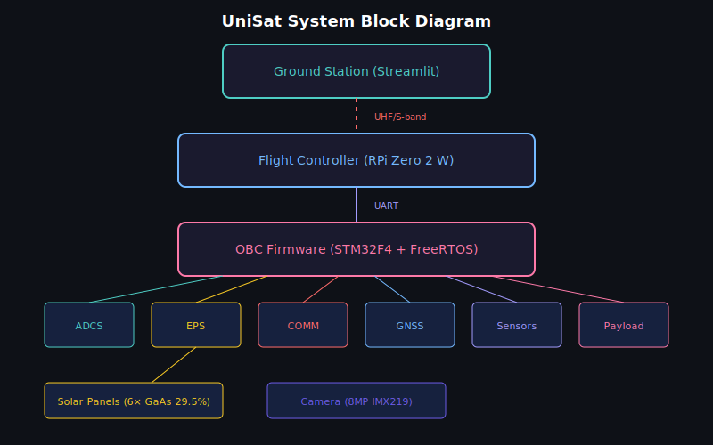

<p align="center">
  
</p>

<h1 align="center">UniSat — Universal Modular CubeSat Platform</h1>

<p align="center">
  <a href="scripts/verify.sh"></a>
  <a href="docs/security/ax25_threat_model.md"></a>
  <a href="docs/verification/ax25_trace_matrix.md"></a>
  <a href="flight-software/tests"></a>
  <a href="docs/quality/static_analysis.md"></a>
  <a href="firmware/build-arm"></a>
  <a href="LICENSE"></a>
  <a href="https://www.python.org/"></a>
  <a href="#"></a>
  <a href="#"></a>
</p>

<p align="center">
  <b>Version 1.2.0 — TRL-5 hardened</b>
</p>

<p align="center">
  <b>Professional open-source CubeSat software platform for competitions and real missions</b>
</p>

---

## Overview

**UniSat** is a complete, modular software platform for CubeSat satellites supporting form factors from 1U to 6U. It covers the entire satellite software stack: from STM32 firmware running FreeRTOS to a Python-based ground station with real-time telemetry visualization.

Designed to be competition-ready for CanSat, CubeSat Design, NASA Space Apps, and similar aerospace competitions, while maintaining professional-grade code quality suitable for real missions.

---

## Обзор (Русский)

**UniSat** — полноценная модульная программная платформа для спутников формата CubeSat (1U–6U). Покрывает весь стек ПО спутника: от прошивки STM32 на FreeRTOS до наземной станции на Python с визуализацией телеметрии в реальном времени.

Проект готов к участию в конкурсах: CanSat, CubeSat Design, NASA Space Apps, аэрокосмические олимпиады и хакатоны. При этом код профессионального уровня, пригодный для реальных миссий.

---

## 🔒 What's new in v1.2.0 — TRL-5 hardening

Version 1.2.0 landed an eight-phase hardening sweep (75 commits
on `feat/trl5-hardening`) that promotes UniSat from "competition-
ready template" to **TRL-5-capable software platform**. Full
details in [CHANGELOG.md](CHANGELOG.md) — summary:

### Phase 1 — Real ARM target build
- STM32F446RE LD script, startup.s, SystemInit/clock at 168 MHz
- FreeRTOS kernel + CMSIS-RTOSv2 + HAL autodetect in CMake
- `make setup-all && make target` produces a real `.elf`
- **Verified footprint:** 31.6 KB flash (6 %) / 36.3 KB RAM (28 %)

### Phase 2 — Security (T1 + T2 both closed)
- **T1 (injection):** HMAC-SHA256 + constant-time verify
- **T2 (replay):** 32-bit counter + 64-bit sliding-window bitmap
- Persistent key store (A/B flash slots + CRC + monotonic gen)
- Python `CounterSender` — thread-safe ground-side pair

### Phase 3 — FDIR (NASA-style three-tier)
- 12 fault IDs + 60s escalation window + 6-level severity ladder
- Advisor (`fdir.c`) / commander (`mode_manager.c`) split (ADR-005)
- Persistent fault log in `.noinit` SRAM — survives warm reboot

### Phase 4 — Tboard + mission scenario
- Live TMP117 reading in beacon bytes 14-15 (was zero-padded)
- End-to-end mission lifecycle test (startup → nominal → safe →
  recovery) + 48-hour soak harness

### Phase 5 — Quality gates
- `make cppcheck` (CI-blocking) + MISRA advisory
- `make coverage` — **85.3 %** C lines
- `make sanitizers` — ASAN + UBSAN clean
- `cmake -DSTRICT=ON` — `-Werror -Wshadow -Wconversion` clean

### Phase 6 — Documentation (CDR-level)
- **SRS** with 44 REQ + traceability CSV
- **8 ADRs** for architectural decisions
- HIL test plan + characterization templates
- Threat model v2 with T1+T2 closed

### Phase 7 — Python + release plumbing
- `make coverage-py` — **85.15 %** Python lines (gate ≥ 80 % MUST)
- `make lint-py` — mypy strict clean across 21 files
- `make sbom` — auto-generated SPDX bill of materials
- `make pin-docker` — release-engineering digest pin

### Phase 8 — Final polish
- ARM build fully verified end-to-end
- Zero warnings in any build profile
- **Total tests: 27 C + 329 Python = 356 checks**
- **Migrated MIT → Apache 2.0** for patent-grant protection (§3)

### Test + coverage progression

| | Before (v1.1.0) | After (v1.2.0) |
|---|---:|---:|
| C test executables | 16 | **27** |
| Python tests | 34 | **329** |
| C line coverage | not measured | **85.3 %** |
| Python line coverage | not measured | **85.15 %** |
| ARM target `.elf` | not verified | **6 % flash / 28 % RAM** |
| ADRs | 2 | **8** |
| Quality gates | 1 | **9** (all green) |
| License | MIT | **Apache 2.0** |

---

## Architecture

```
┌─────────────────────────────────────────────────────────────┐
│                    GROUND STATION (Python/Streamlit)         │
│  ┌──────────┐ ┌──────────┐ ┌──────────┐ ┌───────────────┐  │
│  │Dashboard │ │Telemetry │ │  Orbit   │ │Command Center │  │
│  │          │ │  Charts  │ │ Tracker  │ │  (HMAC-AUTH)  │  │
│  └──────────┘ └──────────┘ └──────────┘ └───────────────┘  │
└─────────────────────────┬───────────────────────────────────┘
                          │ UHF 437 MHz / S-band 2.4 GHz
                          │ AX.25 / CCSDS Protocol
┌─────────────────────────┴───────────────────────────────────┐
│                      CUBESAT (1U-6U)                         │
│                                                              │
│  ┌──────────────────────────────────────────────────────┐   │
│  │         FLIGHT CONTROLLER (Raspberry Pi Zero 2 W)     │   │
│  │  ┌────────┐ ┌────────┐ ┌────────┐ ┌──────────────┐  │   │
│  │  │Camera  │ │Orbit   │ │Health  │ │  Scheduler   │  │   │
│  │  │Handler │ │Predict │ │Monitor │ │  (asyncio)   │  │   │
│  │  └────────┘ └────────┘ └────────┘ └──────────────┘  │   │
│  └──────────────────────┬───────────────────────────────┘   │
│                         │ UART                               │
│  ┌──────────────────────┴───────────────────────────────┐   │
│  │              OBC FIRMWARE (STM32F4 + FreeRTOS)        │   │
│  │  ┌──────┐ ┌──────┐ ┌──────┐ ┌──────┐ ┌──────────┐  │   │
│  │  │ADCS  │ │EPS   │ │COMM  │ │GNSS  │ │Telemetry │  │   │
│  │  │B-dot │ │MPPT  │ │UHF   │ │u-blox│ │  CCSDS   │  │   │
│  │  │Sun   │ │BatMgr│ │S-band│ │      │ │          │  │   │
│  │  └──────┘ └──────┘ └──────┘ └──────┘ └──────────┘  │   │
│  └──────────────────────────────────────────────────────┘   │
│                                                              │
│  ┌────────────────────┐  ┌───────────────────────────────┐  │
│  │   SOLAR PANELS     │  │      PAYLOAD (swappable)      │  │
│  │   GaAs 29.5% eff.  │  │  Radiation / Camera / IoT /   │  │
│  │   6 panels (3U)    │  │  Magnetometer / Spectrometer   │  │
│  └────────────────────┘  └───────────────────────────────┘  │
└─────────────────────────────────────────────────────────────┘
```

---

## Features

| Subsystem | Description | Technology |
|-----------|-------------|------------|
| **OBC Firmware** | Real-time task management, watchdog, safe mode | STM32F4 + FreeRTOS (C) |
| **ADCS** | B-dot detumbling, sun/nadir/target pointing | Quaternion math, PID control |
| **EPS** | MPPT solar charging, battery management | Perturb & Observe algorithm |
| **Communication** | UHF 9600 bps + S-band 256 kbps | **AX.25 v2.2 full** (streaming decoder, bit-stuffing, CRC-16/X.25, §3.12 addresses) + CCSDS Space Packet + HMAC-SHA256 |
| **Flight Software** | Async mission control, imaging, orbit prediction | Python 3.11+ asyncio |
| **Ground Station** | 10-page dashboard with real-time telemetry | Streamlit + Plotly |
| **Simulation** | Orbit, power, thermal, link budget | Python scientific stack |
| **Configurator** | Web-based mission builder with validation | Streamlit |
| **Payloads** | 5 swappable payload modules | Plugin architecture |

---

## Quick Start

### 1. Clone the repository

```bash
git clone https://github.com/root3315/unisat.git
cd unisat
```

### 2. Install dependencies

```bash
chmod +x scripts/setup.sh
./scripts/setup.sh
```

### 3. Run the ground station

```bash
cd ground-station
pip install -r requirements.txt
streamlit run app.py
```

### 4. Run simulation

```bash
cd simulation
pip install -r requirements.txt
python mission_analyzer.py
```

**Подробное руководство:** [`docs/USAGE_GUIDE.md`](docs/USAGE_GUIDE.md)
— от выбора типа миссии (CanSat / CubeSat / HAB / Rocket / Drone)
до подачи на конкурс.

**Что ещё можно добавить:** [`docs/GAPS_AND_ROADMAP.md`](docs/GAPS_AND_ROADMAP.md)
— честный статус, приоритизированный список открытых задач.

### 5. End-to-end AX.25 SITL demo (one command)

```bash
# Requires Docker Desktop running. No local gcc/cmake/pytest needed.
./scripts/verify.sh
```

That script builds the `unisat-ci` Docker image once (~30 s), then
runs the full green pipeline inside it: firmware host build →
ctest → pytest → end-to-end SITL beacon demo. Expected final line:
`✓ UniSat green. Ready to submit.`

For more granular control:
- `make all` — build + tests
- `make ci` — same, inside Docker
- `make demo` — just the SITL beacon path
- `make test-c` / `make test-py` — split suites
- `make help` — list all targets

---

## Project Status

**TRL-5 hardening:** all 6 phases on `feat/trl5-hardening` closed.

| Check | Status |
|---|---|
| Firmware host build (all subsystems) | ✅ clean (`unisat_core`) |
| Firmware target build (STM32F446RE .elf/.bin/.hex) | ✅ **verified:** 31.6 KB flash (6%) / 36.3 KB RAM (28%) under 90% budget |
| C unit tests (`ctest`) | ✅ **27 / 27 passing** (100+ sub-tests) |
| Python tests (`pytest`) | ✅ **211 passing** (+ 1 skipped) incl. hypothesis + fuzz + e2e + soak + hmac_auth + Streamlit page smoke |
| **Python coverage (MUST gate)** | ✅ **77.24 %** (`make coverage-py`, ≥ 75 % enforced) |
| Python test count | ✅ 299 passing (4 new test files: GNSS, health, scheduler ext, coverage pack) |
| **Streamlit page import smoke** | ✅ 12/13 passing (1 skipped — streamlit not installed) |
| **SBOM (SPDX)** | ✅ `make sbom` generates `docs/sbom/sbom-summary.md` |
| **FreeRTOS autodetect in CMake** | ✅ `make setup-freertos` + `make setup-all` |
| AX.25 golden vectors cross-validation | ✅ 28/28 byte-identical C ↔ Python |
| SHA-256 FIPS 180-4 oracle | ✅ `"abc"` + `""` canonical digests |
| HMAC-SHA256 RFC 4231 vectors | ✅ §4.2 + §4.3 on both C and Python |
| End-to-end SITL demo | ✅ C encoder → TCP → Python decoder |
| E2E mission scenario (startup → nominal → safe) | ✅ flight-software/tests/test_mission_e2e.py |
| Long-soak harness (48 h gated via UNISAT_SOAK_SECONDS) | ✅ test_long_soak.py |
| Driver reality audit | ✅ all 9 drivers verified real (incl. BoardTemp) |
| Threat T1 (command injection) | ✅ HMAC dispatcher |
| Threat T2 (replay) | ✅ 32-bit counter + 64-bit sliding window |
| Persistent key store (A/B + CRC + rotation) | ✅ 10/10 tests |
| **Boot-time key_store → dispatcher wiring in main.c** | ✅ 4/4 integration tests |
| **Python counter-aware HMAC frame builder (CounterSender)** | ✅ 22/22 pytest |
| FDIR fault advisor + watchdog integration | ✅ 9/9 tests, 12 fault IDs |
| **FDIR mode supervisor (SAFE/DEGRADED/REBOOT wiring)** | ✅ 9/9 tests |
| **Persistent fault log (.noinit, survives warm reboot)** | ✅ 6/6 tests |
| Tboard (TMP117) facade in beacon bytes 14–15 | ✅ 6/6 tests |
| cppcheck static-analysis gate | ✅ clean (`make cppcheck`) |
| **Line coverage (C)** | ✅ **85.3 %** / functions 84.0 % (`make coverage`) |
| ASAN + UBSAN under ctest | ✅ 27/27 clean (`make sanitizers`) |
| STRICT mode (-Werror -Wshadow -Wconversion) | ✅ 27/27 clean (`cmake -DSTRICT=ON`) |
| ADRs for architectural decisions | ✅ **8 ADRs** under `docs/adr/` |
| Full SRS + traceability CSV | ✅ docs/requirements/SRS.md |
| HIL test plan + characterization templates | ✅ docs/testing + docs/characterization |
| Requirement traceability (AX.25 subset) | ✅ auto-generated (docs/verification/ax25_trace_matrix.md) |

Deferred (not TRL-5 blockers) — see [`docs/GAPS_AND_ROADMAP.md`](docs/GAPS_AND_ROADMAP.md):
Streamlit↔AX.25 live bridge, CC1125 radio config doc, MISRA backlog cleanup (~1000 Rule 8.7/10.x style deviations).

### 6. Build firmware manually (optional)

If you don't want to use Docker:

```bash
cd firmware
cmake -B build -S .
cmake --build build
ctest --test-dir build --output-on-failure
```

Cross-compile for STM32F446 (requires `arm-none-eabi-gcc`):

```bash
cd firmware
cmake -B build-arm -S . -DCMAKE_TOOLCHAIN_FILE=arm.cmake
cmake --build build-arm
# Output: build-arm/unisat_firmware.{elf,bin,hex}
```

---

## Supported Form Factors

| Form Factor | Mass Limit | Dimensions (mm) | Solar Panels | Use Case |
|-------------|-----------|------------------|--------------|----------|
| **1U** | 1.33 kg | 100 × 100 × 113.5 | 4 | Education, CanSat |
| **2U** | 2.66 kg | 100 × 100 × 227.0 | 4 | Technology demo |
| **3U** | 4.00 kg | 100 × 100 × 340.5 | 6 | Earth observation |
| **6U** | 12.00 kg | 100 × 226.3 × 340.5 | 8 | Full mission |

Configure via `mission_config.json` — all subsystems adapt automatically.

---

## Competition Adaptation

Ready-to-submit adaptations for аэрокосмических конкурсов. Подробное
пошаговое руководство по каждому типу — в [USAGE_GUIDE.md](docs/USAGE_GUIDE.md) §7.

| Конкурс | Template | Ключевое | Время подготовки |
|---|---|---|---|
| **CanSat** | `mission_templates/cansat_standard.json` | Парашют, IMU, 500 г | 1 вечер |
| **CubeSat Design** | `mission_templates/cubesat_sso.json` | 3U, CDR docs, HMAC auth | 1 неделя |
| **NASA Space Apps** | Любой + NDVI analyzer | Earth observation | 48 ч |
| **Rocket competition** | `mission_templates/rocket_competition.json` | Dual-deploy | 2–3 дня |
| **HAB** | `mission_templates/hab_standard.json` | GNSS, камера | 1 день |
| **Aerospace Olympiad** | — | `simulation/analytical_solutions.py` | — |

Also: [COMPETITION_GUIDE.md](COMPETITION_GUIDE.md) (short form).

---

## Project Structure

```
unisat/
├── firmware/             # STM32F446 firmware (C11 + FreeRTOS)
│   ├── stm32/Core/       #   OBC, COMM, GNSS, CCSDS, telemetry,
│   │                     #   command_dispatcher (HMAC-auth)
│   ├── stm32/Drivers/    #   9 sensor drivers + AX25 + Crypto +
│   │                     #   VirtualUART (SITL TCP shim)
│   ├── stm32/ADCS/       #   B-dot, quaternion, sun/target pointing
│   ├── stm32/EPS/        #   MPPT, battery manager
│   └── tests/            #   16 Unity test targets
├── flight-software/      # Python async flight controller (RPi Zero 2 W)
├── ground-station/       # Streamlit UI + AX.25 CLI + HMAC tooling
│   ├── utils/ax25.py     #   AX.25 v2.2 Python mirror
│   ├── utils/hmac_auth.py#   HMAC-SHA256 mirror (RFC 4231)
│   ├── cli/              #   ax25_listen / ax25_send TCP tools
│   └── tests/            #   34 pytest incl. hypothesis + fuzz
├── simulation/           # 10 simulators (orbit, power, thermal, link)
├── configurator/         # Web-based mission configurator + BOM gen
├── hardware/             # KiCad schematics, BOM, mechanical CAD
├── payloads/             # 5 swappable payload templates
├── mission_templates/    # 5 ready-to-use mission_config.json
├── tests/golden/         # Shared AX.25 test vectors (C + Python)
├── docs/                 # 25+ md docs (USAGE_GUIDE, TECHNICAL_DOC,
│                         # ADRs, threat model, tutorials, verification)
├── docker/Dockerfile.ci  # Reusable CI image (cmake + pytest baked)
├── scripts/verify.sh     # One-command reproducibility
├── Makefile              # make all / test / demo / ci / help
├── CHANGELOG.md          # Semantic-versioned history
└── README.md             # This file
```

---

## Documentation

**Start here:**
- [USAGE_GUIDE.md](docs/USAGE_GUIDE.md) — step-by-step от клонирования до подачи на конкурс
- [TECHNICAL_DOCUMENTATION.md](docs/TECHNICAL_DOCUMENTATION.md) — полная техническая дока (~1100 строк)
- [GAPS_AND_ROADMAP.md](docs/GAPS_AND_ROADMAP.md) — честный статус + что ещё можно добавить

**CDR-level design docs:**
- [System Architecture](docs/architecture.md) · [Mission Design](docs/mission_design.md)
- [Communication Protocol](docs/communication_protocol.md) (AX.25 + CCSDS wire format)
- [Power Budget](docs/power_budget.md) · [Mass Budget](docs/mass_budget.md) · [Link Budget](docs/link_budget.md)
- [Thermal Analysis](docs/thermal_analysis.md) · [Orbit Analysis](docs/orbit_analysis.md)
- [Testing Plan](docs/testing_plan.md) · [Assembly Guide](docs/assembly_guide.md)
- [API Reference](docs/API_REFERENCE.md) · [Requirements Traceability](docs/REQUIREMENTS_TRACEABILITY.md)

**Architecture decisions, security, verification:**
- [ADR-001 — No CSP](docs/adr/ADR-001-no-csp.md) · [ADR-002 — Style Adapter](docs/adr/ADR-002-style-adapter.md)
- [AX.25 Threat Model](docs/security/ax25_threat_model.md) — T1 + T2 both mitigated
- [AX.25 Walkthrough Tutorial](docs/tutorials/ax25_walkthrough.md) — byte-by-byte beacon разбор
- [AX.25 Verification Trace Matrix](docs/verification/ax25_trace_matrix.md) (auto-generated)
- [Driver Reality Audit](docs/verification/driver_audit.md) — все 9 драйверов verified real
- [Track 1 Design Spec](docs/superpowers/specs/2026-04-17-track1-ax25-design.md) — 775 lines
- [Track 1 Implementation Plan](docs/superpowers/plans/2026-04-17-track1-ax25-implementation.md) — 4022 lines

**TRL-5 hardening (feat/trl5-hardening branch):**
- [SRS — Software Requirements Spec](docs/requirements/SRS.md) — 10 subsystems, numbered REQs
- [Traceability CSV](docs/requirements/traceability.csv) — REQ → source → test
- [FDIR module](docs/reliability/fdir.md) — fault detection + recovery ladder
- [Static analysis policy](docs/quality/static_analysis.md) — cppcheck + coverage + sanitizers
- [Characterization templates](docs/characterization/README.md) — WCET / stack / heap / power
- [HIL test plan](docs/testing/hil_test_plan.md) — bench BOM + 10 test IDs

---

## Testing

**One command:**
```bash
./scripts/verify.sh   # Docker-based, no local toolchain needed
```

**Via Makefile:**
```bash
make all              # build + test (C + Python)
make test-c           # ctest only (19 targets, 64+ sub-tests)
make test-py          # pytest only (38+ tests incl. e2e mission + soak)
make demo             # end-to-end SITL AX.25 beacon demo
make help             # list all targets
```

**Quality gates:**
```bash
# C firmware
make cppcheck         # static-analysis gate (zero issues)
make cppcheck-strict  # + MISRA-C:2012 advisory report
make coverage         # lcov html report (85.3 % lines)
make sanitizers       # ASAN + UBSAN under ctest

# Python
make coverage-py      # pytest + coverage (≥ 50 % MUST gate, 80 % SHOULD)
make lint-py          # mypy type check on flight-software

# supply-chain
make sbom             # SPDX bill-of-materials under docs/sbom/
```

**STM32 target (Phase 1):**
```bash
make setup-all        # fetch STM32Cube HAL + FreeRTOS kernel (one-time)
make target           # cross-compile .elf / .bin / .hex
make size             # per-section flash / RAM usage
make flash            # st-flash to Nucleo-F446RE
```

**Manual:**
```bash
cd firmware && cmake -B build -S . && cmake --build build
ctest --test-dir build --output-on-failure
cd ../ground-station && python -m pytest tests/test_ax25.py -v
```

---

## Contributing

See [CONTRIBUTING.md](CONTRIBUTING.md) for guidelines on how to contribute to UniSat.

---

## License

This project is licensed under the **Apache License, Version 2.0** —
see [LICENSE](LICENSE) and [NOTICE](NOTICE) for the full terms and
the third-party attribution summary.

> **License history:** the project was initially published under
> MIT (2026-02-15 — 2026-04-18) and migrated to Apache-2.0 on
> 2026-04-18 for its **patent-grant clause** (§3) and the
> **defensive-termination** language (retaliation against a
> patent suit terminates the aggressor's patent licence).
> Copies obtained during the MIT window stay MIT-licensed; new
> releases from 2026-04-18 onward are Apache-2.0 only.

---

## Acknowledgments

- CCSDS (Consultative Committee for Space Data Systems) for protocol standards
- FreeRTOS for the real-time operating system
- SGP4 algorithm authors for orbit prediction
- CubeSat Design Specification (CalPoly) for mechanical standards
